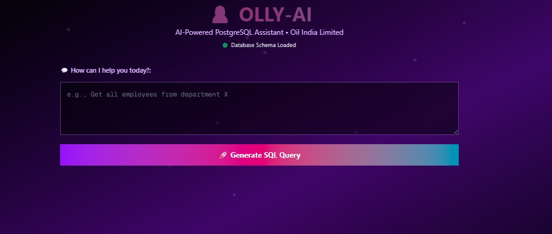

<h1 align="center">🤖 Olly — The Offline AI Data Whisperer</h1>

made for oil india as an internship project......

  <i>Talk to your database like it's ChatGPT — but fully offline.</i> 
  <strong>Natural Language → SQL → Result</strong>

  
  
  
  
  

---

## 🧠 What is Olly?

**Olly** is a local-first AI chatbot that understands your questions in natural language, converts them to SQL, fetches relevant data from your PostgreSQL database, and gives back meaningful insights — all offline.  
No APIs. No servers. No latency.

> 💬 _“Show me all assets under AMC that expire this month”_  
> Olly → SQL → JSON → Human-readable insights.

---

## 🚀 Tech Stack

| Layer       | Technology                          |
|-------------|--------------------------------------|
| UI          | `Next.js`, `Tailwind`, `ShadCN/UI`  |
| Database    | `PostgreSQL`                        |
| AI Engine   | `Ollama` with `LLaMA 3.2`            |
| Container   | `Docker` (multi-service setup)      |
| Optional UI | `Gradio` or custom frontend shell   |

---

## ⚙️ Features

- ✅ Offline — works without Internet
- 🧠 Local LLM inference via LLaMA 3.2
- 🗣️ Natural language → SQL conversion
- 📊 Renders SQL results into readable format
- 🔐 Privacy-safe for enterprise/internal tools
- ✨ Smooth, modern animated UI (shadcn/ui)

---

## 🖼 UI Preview

> *Minimal, black-themed, modern interface with animated transitions.*

  

> 🎨 Want to preview it? Run locally with Docker or open in Codespaces.

---

## 🧪 How it Works (Internally)

* 💬 User Input → LLM prompt (with table context)
* 📄 Olly (LLaMA3.2 via Ollama) returns SQL query
* 🧵 Executes query using Sequelize/SQLAlchemy
* 🔄 Formats result in a neat, plain answer
* 🖥️ All running inside Dockerized services

---

## 🛡 Security

* Runs fully offline on your machine
* No external API calls
* Your schema and data never leave your system

---

## 📝 License

MIT © [prax860](https://github.com/prax860)

---

> *“Olly doesn't search. Olly *knows*.”*

